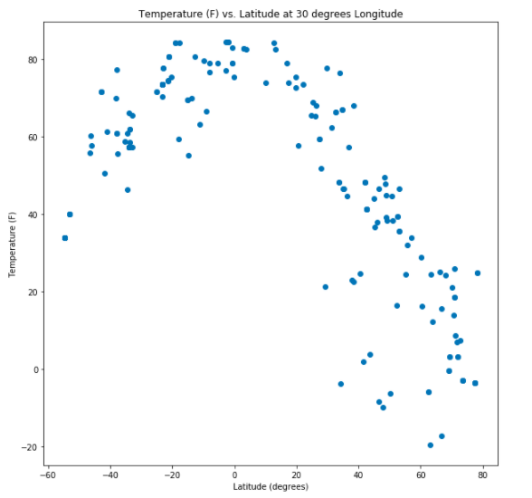
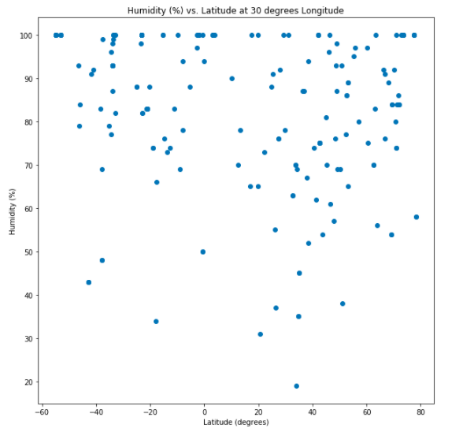
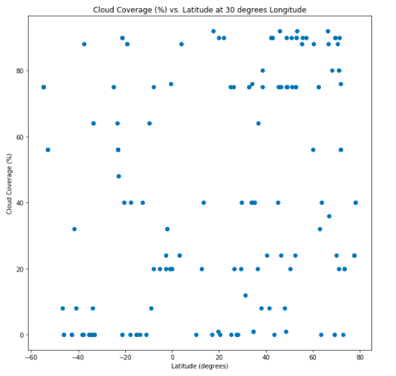
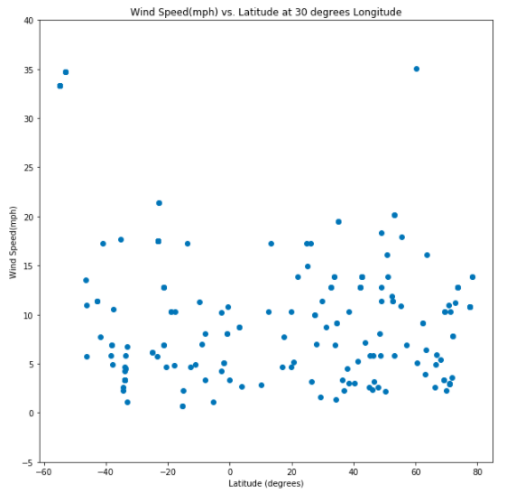
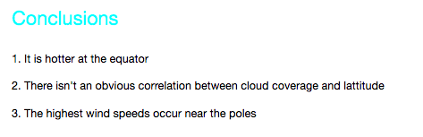

# PyWeather
A python script to visualize the weather of 500+ cities across the world. 

A Python script to visualize the weather of 500+ cities across the world of varying distance from the equator. Utilizes a [simple Python library](https://pypi.python.org/pypi/citipy and the [OpenWeatherMap API](https://openweathermap.org/api). 

Contains a series of scatter plots to showcase the following relationships:

* Temperature (F) vs. Latitude

* Humidity (%) vs. Latitude

* Cloudiness (%) vs. Latitude

* Wind Speed (mph) vs. Latitude

